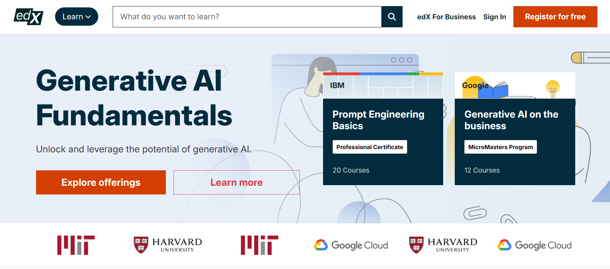
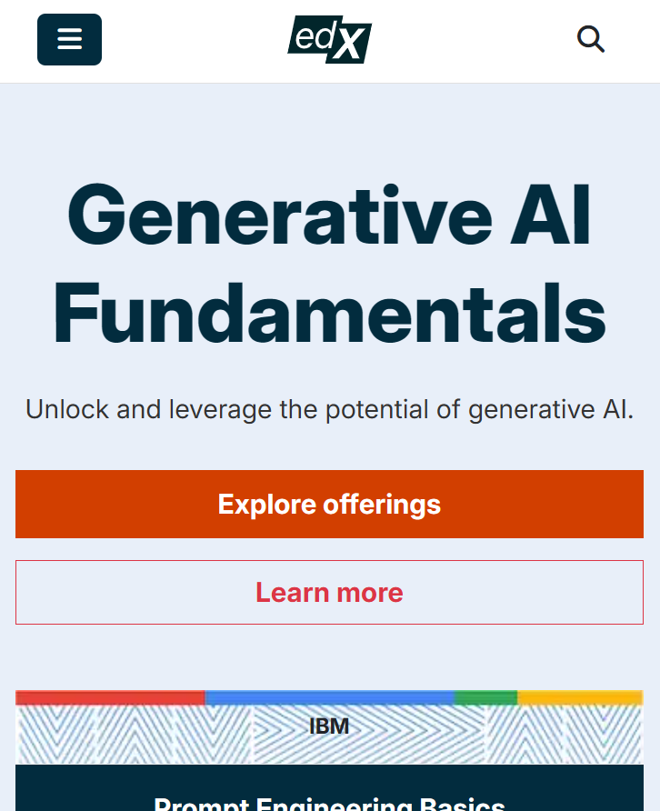

   
         
   
  
  

    
    
    
    
  

   
 <h1>🌐 EDX Clone – HTML & CSS University Project</h1>
 

A simple, responsive, and visually appealing **EDX-inspired online learning platform UI**, created as a university project using **HTML, CSS, bootstrap, js**.  
This project focuses on layout design, responsive pages, and modern UI components without any backend.

---

## 🎯 Project Overview
This project is a front-end clone of the popular MOOC platform **edX**, featuring multiple pages such as homepage, courses, and login system UI.  
Its purpose is to demonstrate **HTML/CSS design skills**, clean structure, and responsive layout techniques.

---

## ✨ Features (Front-End Only)
- ✔️ Fully responsive web design  
- ✔️ Beautiful homepage with hero banner  
- ✔️ Courses listing page  
- ✔️ Course details page  
- ✔️ Login & Signup static pages  
- ✔️ Clean and modern UI  
- ✔️ Reusable components (buttons, cards, sections)  
- ✔️ Organized HTML & CSS structure  

---

## 🧰 Frontend Tools & Technologies

This project was built using a simple and clean front-end development stack.  
Our focus was on responsive UI, layout structure, and design quality.

### 🛠️ Core Technologies
- **HTML5** – Semantic structure for all pages  
- **CSS3** – Styling, layout, animations  
- **bootstrap** – Modern layout system for alignment
- **CSS Grid** – Page structure and responsiveness  

### 🎨 Design & UI Tools
- **Google Fonts** – Elegant typography  
- **Font Awesome / Remix Icons** – Icons for UI elements  
- **Color Hunt / Coolors** – Palette selection for theme

### 📁 Project Management Tools
- **Git & GitHub** – Version control, hosting  
- **VS Code** – Code editor with Live Server  
- **Prettier** – Code formatting for clean structure  

### ⚡ Optimization & Assets
- **CompressJPEG / TinyPNG** – Image compression  
- **Unsplash / Pexels** – High-quality images  

---

## 🚀 How to Run
Simply open the main file in your browser:

---

No installation required.

---

## 📸 Screenshots

  <h1>Mobile version</h1>
  

## 🎓 Project Purpose
This project was created for a **University Web Development Course** to practice:

- Structuring web pages  
- Creating modern UI layouts  
- Working with Flexbox & Grid  
- Building responsive websites with pure HTML & CSS  

---

## ⭐ Show Your Support
If you like this project, kindly **give it a star ⭐ on GitHub** — it motivates future improvements!

---

